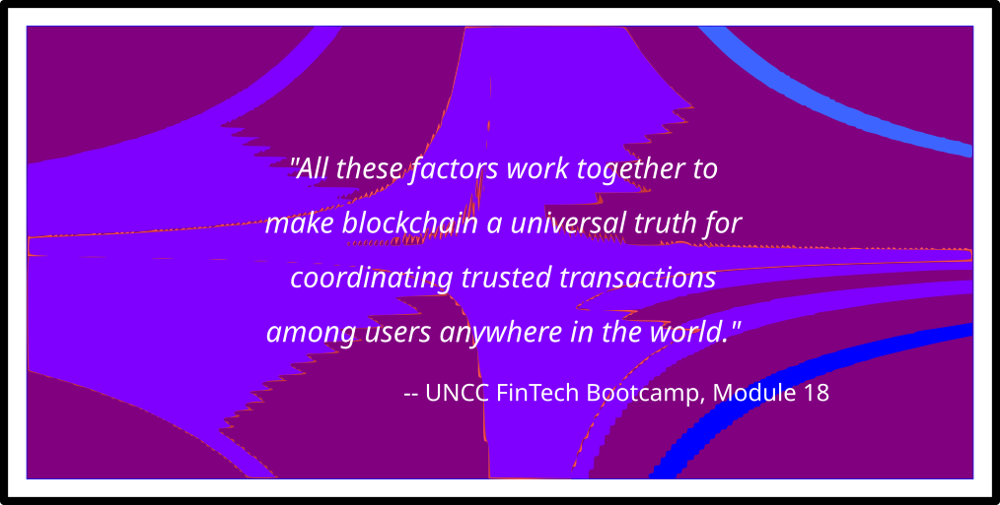

# Blockchain with Python
UNCC Online FinTech Bootcamp Module 18 Challenge due by 11:59pm 4/10/2022

[bootcampspot.com](https://courses.bootcampspot.com/courses/980/pages/18-dot-3-7-activity-validating-the-blockchain?module_item_id=378005)

---

## Background

We are fintech engineers working at one of the five largest banks in the world. We were recently promoted to act as the lead developer on their decentralized finance team. Our task is to build a blockchain-based ledger system, complete with a user-friendly web interface. This ledger should allow partner banks to conduct financial transactions (that is, to transfer money between senders and receivers) and to verify the integrity of the data in the ledger.

---

## What is Being Created

A python script `pychain.py` is written using Visual Studio Code, and includes a user-friendly web interface handled by Streamlit. The code will employ blockchain technology to build a ledger that will allow partner banks to conduct financial transactions and to verify the integrity of the data in the ledger.

---

## Technologies

This application is written in Python 3.7 using Visual Studio Code

 - [Pandas](https://pandas.pydata.org/pandas-docs/stable/) - *an open source, BSD-licensed library providing high-performance, easy-to-use data structures and data analysis tools for the Python programming language.*
 - [Streamlit](https://streamlit.io/) - *an open source library that turns data scripts into shareable web apps in minutes.

### Installation Guide

prior to running these libraries, install them from the command line:
  - pandas: `conda install pandas` or `pip install pandas`  
  - streamlit: `pip install streamlit`
  
---

## Usage

---

## Contributors
Geoff Tarleton - jobeycat@protonmail.com

adapted from Starter Code supplied by UNCC FinTech Online Bootcamp by Trilogy Educational Services, a 2U, Inc. brand.

---

## License

[MIT](LICENSE)